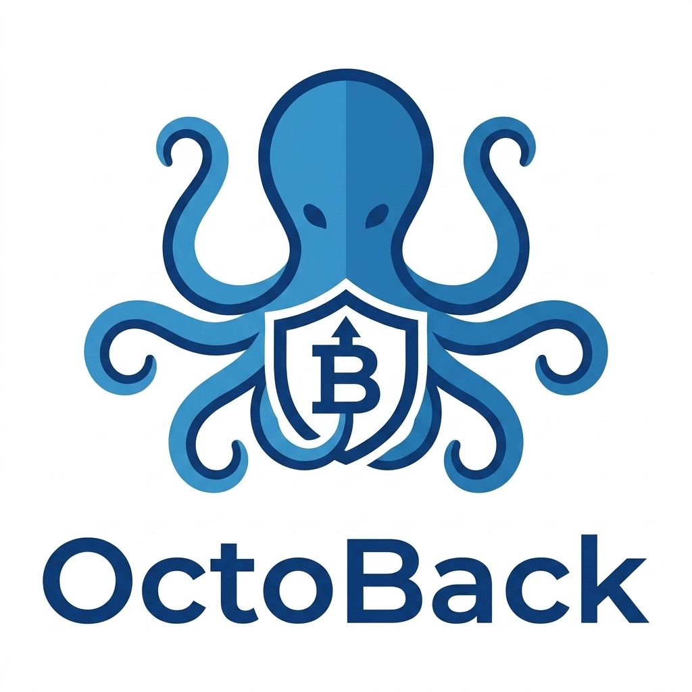

# 🐙 OctoBack



OctoBack is a lightweight CLI backup manager that separates the **intent** (what to back up) from the **action** (the actual backup process). By maintaining a curated index of files and folders, OctoBack ensures your backup vault remains organized, predictable, and clean.

---

## 🚀 Features

- **Decoupled Architecture**: Specify what you want to track separately from when and how you back it up.
- **Context-Aware Restoration**: Restore folders or files contextually based on your shell's current working directory (`pwd`).
- **Interactive TUI Restore Mode**: Use keys to visually browse, select, and restore backed-up items inside the current directory.
- **Path Protection**: Safeguarded against directory traversal attacks (Zip Slip) and shell injection exploits.
- **Easy Installation**: Comes with a quick installation script.

---

## 📦 Installation

To install OctoBack globally to your local user binary directory (`~/.local/bin`), run the following command in the project root:

```bash
./install.sh
```

Ensure that `~/.local/bin` is in your shell's environment `$PATH`. If it is not, add the following to your `~/.bashrc` or `~/.zshrc`:

```bash
export PATH="$PATH:$HOME/.local/bin"
```

---

## 🛠️ Usage

### 1. Setup
To initialize your environment and generate the default `octo.yaml` configuration file, run:

```bash
octoback init
```

By default, this sets up configuration files under `~/.octoback/` and a default vault at `~/Vault`.

#### Default Configuration (`~/.octoback/octo.yaml`)
```yaml
storage:
  index_path: "~/.octoback/index.json"
  vault_path: "~/Vault"
```

### 2. The Indexing Phase
Rather than transferring files on the fly, you curate an index of important folders and files you want to track.

* **Add a folder/file to the index**:
  ```bash
  octoback add folder/
  ```
  If no directory is specified, it defaults to the current directory (`.`).

* **Recursive Indexing**:
  ```bash
  octoback add -R folder/
  ```
  The `-R` flag scans the directory and indexes all subfolders and files individually for granular restore control.

### 3. The Execution Phase
Trigger the backup sync using:

```bash
octoback backup
```

OctoBack reads `index.json`, mirrors your absolute folder structures inside the vault, compresses them safely into a single package (`block.tar.gz`), and cleans up the uncompressed staging files.

### 4. The Recovery Phase
Restoring files is fast and can be done selectively:

* **Restore a specific file/folder**:
  ```bash
  octoback restore path/to/file_or_folder
  ```
  If no path is specified, it defaults to restoring the current directory from the backup archive.

* **Interactive TUI Restore**:
  Run this command to visually browse, select (using `Space`), and restore tracked items inside the current folder:
  ```bash
  octoback restore list
  ```

* **Full System Restore**:
  Restore all indexed folders and files recorded in the database to their original paths:
  ```bash
  octoback restore --all
  ```

---

## 🗺️ Roadmap & Configuration Options

The configuration file is designed to support the following engine extensions, currently planned for future release:
- **`copy_tool`**: Toggle backup engines between `rsync` and `cp`.
- **`compression`**: Choose archive compression algorithm (`none`, `gzip`, `zstd`).
- **`security`**: Enable AES-256 encryption.
- **`track_history`**: Enable versioned vault history.

---

## 📄 License
This project is open-source and available under the [MIT License](LICENSE).
